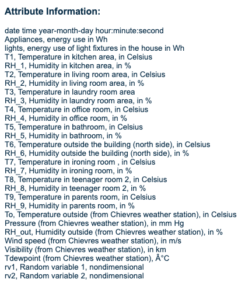

# Appliance and Light Energy Forecasting
This project is for CMSE 492: Applied Machine Learning

# Table of Contents

- [Project Description](#project-description)
- [Installation](#installation)
- [Running the project](#running-the-project)
- [References](#references)

## Project Description

### Project Purpose
Over the course of the semester we have been learning about different machine learning techniques, when they should be used, along with the advantages and disadvantages of them. In this project, I will be working on forecasting the energy usage of appliances. We have not worked a lot with timeseries analysis so this will be a project that will allow me to learn an important technique.

### Expected Outcomes
- Forecast appliance energy usage
- Forecast light energy usage
- Identify if certain features affect energy usage of appliances and lights
- Quantify affect of features if they do affect energy usage of appliances and lights

### Dataset

The dataset I will be using is from the [UCI Machine Learning Repository](https://archive.ics.uci.edu/ml/index.php) and is titled [Appliances energy prediction Data Set](https://archive.ics.uci.edu/ml/datasets/Appliances+energy+prediction).  
Source: Luis Candanedo, luismiguel.candanedoibarra '@' umons.ac.be, University of Mons (UMONS).  
There are quite a few attributes in this dataset. Here is an explanation of what each abbreviation and number represent:  

### Initial Proposal

- [Initial Project Proposal](https://github.com/parksjr5/Energy_Forecasting/blob/main/Parks_Proposal.pdf)

## Installation

### Clone the repository to your local files

`git clone https://github.com/parksjr5/Energy_Forecasting`

### Installing dependencies for project

In order for the project to work, python needs to be downlaoded to your system. FOr more information, visit [python documentation.](https://www.python.org/downloads/)

After python has been installed, you will need to install all the library dependencies for the project. Run the following command in order to get the files locally on your computer:

`pip install -r dependencies.txt`

In order for this command to work, you need pip installed on your machine. If you do not have pip installed or for more information, visit [pip documentation.](https://pip.pypa.io/en/stable/installation/)

## Running the Project

### Code

- `timeseries.ipynb`: jupyter notebook that imports the *Appliances energy prediction Data Set* and runs timeseries analysis. Comments are included in the notebook for users to understand each step in the model from beginning to end.

### Running the code

1. Clone the repository locally: `git clone https://github.com/parksjr5/Energy_Forecasting`

2. Move into the Energy_Forecasting folder: `cd Energy_Forecasting`

3. While in the Energy_Forecasting folder, open jupyter notebook locally from your terminal.

4. Open the `timeseries.ipynb` and follow along with the steps in the notebook.

## References
- [UCI Machine Learning Repository: Appliances energy prediction Data Set](https://archive.ics.uci.edu/ml/datasets/Appliances+energy+prediction)